  

  <a href="https://levimc.org"><b>levimc.org</b></a> ·
  <a href="https://lamina.levimc.org">Docs</a> ·
  <a href="https://github.com/LiteLDev/LeviLamina">LeviLamina</a> ·
  <a href="https://github.com/LiteLDev/LegacyScriptEngine">LegacyScriptEngine</a> ·
  <a href="https://github.com/LiteLDev/LeviLaunchroid">LeviLaunchroid</a> ·
  <a href="https://github.com/LiteLDev/LeviLauncher">LeviLauncher</a> ·
  <a href="https://discord.gg/v5R5P4vRZk">Discord</a>

Not affiliated with Mojang Studios.

